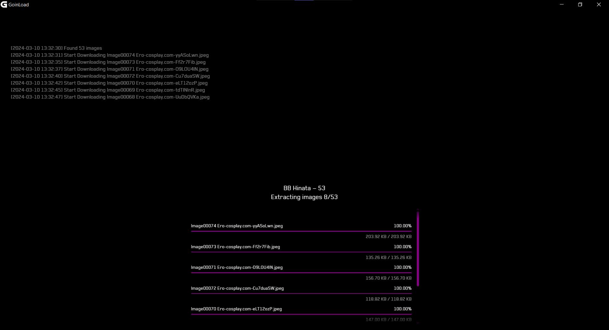

## GoinLoad — Bulk Image Downloader for cyberdrop.me

**GoinLoad** is a desktop application that lets you scrape and download all images from a cyberdrop.me gallery in one click. It's built with Golang and Wails, making it cross-platform (Windows, Linux, and Mac).

### Screenshots

<p align="center">
  
  
</p>

### Features

- [x] Download all images gallery with a single URL.
  - [x] Supported websites: cyberdrop, bunkr, ososedki
- [x] Saves images in their original format and quality.
- [x] Progress bar keeps you informed of the download process.
- [x] Simple and intuitive interface.
- [x] Implement multi-threading for faster downloads (only for some sites).

### Limitations

- ⛔ Currently only supports image download.

### Roadmap:

- [ ] Add support for other websites.
- [ ] Add support for video downloads.
- [ ] Add a progress bar for each individual image download.

### Getting Started

1. Download the latest release for your operating system from the Releases [Here](https://github.com/VinceMoc/GoinLoad/releases/latest).
2. Extract the downloaded file.
3. Run the executable file (`goinload.exe` for Windows, `goinload` for Linux and Mac).
4. Enter the URL of the gallery you want to download and click "Enter".

## Development

### Prerequisites

- [Go](https://golang.org/) (1.18+) and [Node](https://nodejs.org) (15+) installed on your machine.
- [Wails](https://wails.io/) framework installed.

### Installation

1. Clone the repository:

git clone https://github.com/VinceMoc/GoinLoad.git
cd GoinLoad

2. Install dependencies:

```
wails init
```

3. Run the application:

```
wails dev
```

The app window should will open. You can also access the application in your web browser at http://localhost:34115.

4. Build the application:

```
wails build
```

**License**

This project is licensed under the MIT License.
